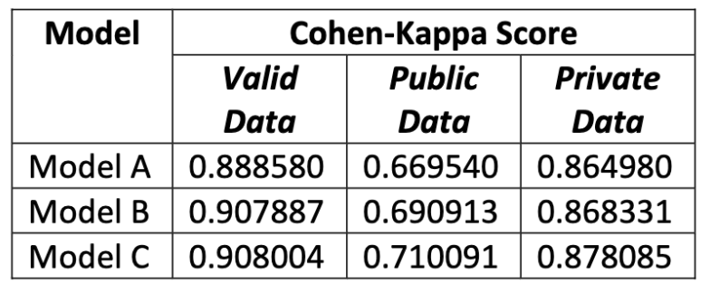
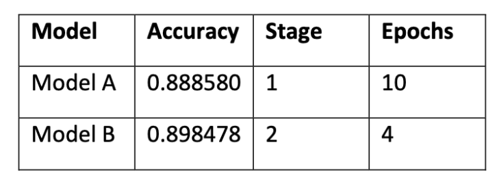

# Detecting Diabetic Retinopathy by using Transfer Learning with the help of Progressive Resizing

This paper tries to study whether Progressive Resizing works and whether it helps us train for longer and what kind of accuracy can be achieved by such a single model trained using Transfer Learning [1] to detect Diabetic Retinopathy. For small datasets or datasets where it is not possible to gain increase our data it is not possible for the data to be trained for long as the amount of information is less so in order to train for longer and to improve accuracy, we can make use of Progressive Resizing.

This basically means that suppose the size of our images is 256 x 256 then we first resize it to 128 x 128 and train on it and once this training is finished, we can again resize our data to 256 x 256 and train here. As a change in size means that for a deep neural network this is completely new set of data we can train for twice as long without overfitting and also as this model was already good for detecting images at 128 x 128 by Transfer Learning idea it will also be fairly good at size 256 x 256 and after training our accuracy will improve. This also ensures that our model generalize better.

This paper is submitted to  ICSIDEMPC-2020 - http://icsidempc.jnec.org/ .

# Comments

The models created here are just used to show the increase in accuracy that can be achieved by using Progressive Resizing and are not the best way to solve this task. Hoping you also understand how interesting and exicting Progressive Resizing is :-).

# Install Dependencies

The code requires python 3.5 or above. And the fastai v1 package which can be installed using the following:

`
pip install http://download.pytorch.org/whl/cpu/torch-1.0.0-cp36-cp36m-linux_x86_64.whl 
pip install fastai
`

# Code

All the code used in this paper has been written in a Jupyter Notebook and can be opened using any notebook environment. Also the final exported models are present in the models directory. Training and inference instructions are present in the notebook. The data used for training these models can be found at:

`https://www.kaggle.com/c/aptos2019-blindness-detection/data`

# Output 

## Cohen Kappa Score of the 3 models on Kaggle public and private data:

## Training Speed of Model A and B to the same accuracy:

